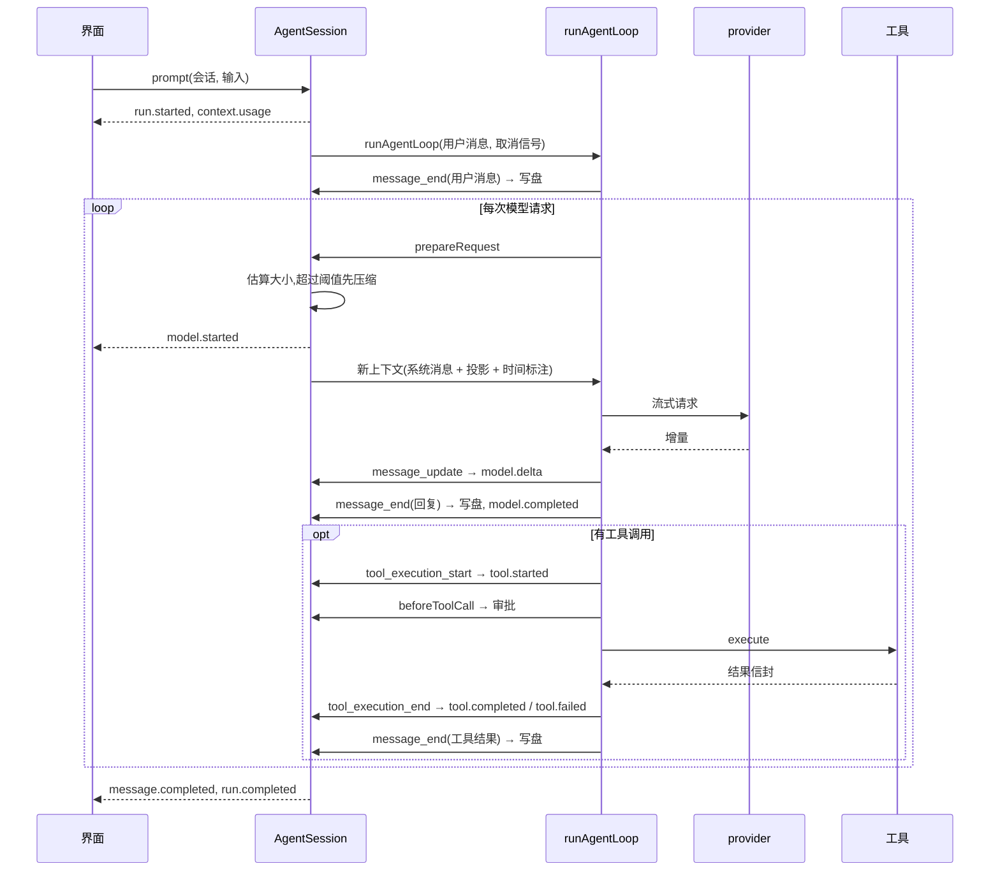

# MiniBot 架构

## 1. 分层

引擎交给 pi,MiniBot 的概念留在自己手里。pi 只提供不带状态的函数(循环和模型调用),所有状态都归 MiniBot。

| 层 | 模块 | 职责 |
|---|---|---|
| 引擎 | `pi-ai`、`pi-agent-core` 的 `runAgentLoop` | 模型接入、流式输出、agent 循环、工具执行 |
| 运行时 | `src/runtime/agent-session.ts` | 一个会话同一时间只有一轮;写盘、事件翻译、审批、请求次数上限、收尾 |
| | `src/runtime/retry-stream.ts` | 包住模型流:第一个输出之前失败就重试 |
| | `src/runtime/context.ts` | 系统提示、请求里的时间标注、请求大小估算(`Budget`) |
| | `src/runtime/compaction.ts` | 切点规划和摘要压缩 |
| | `src/runtime/approval.ts` | 审批策略和 Web 用的审批会合点 |
| | `src/runtime/run-log.ts`、`tracing.ts` | 事件流的订阅者:runs.jsonl 和 Langfuse |
| | `src/runtime/bootstrap.ts` | 组装入口 |
| 存储 | `src/session/` | 只追加的会话记录和它的投影 |
| 能力 | `src/tools/`、`src/mcp/` | 本地工具、macOS 工具、MCP 工具 |
| 界面 | `src/ui/`、`src/server/`、`web/` | 终端界面、行式 REPL、HTTP/SSE 和网页 |
| 主动性 | `src/scheduler/` | 定时任务、心跳、daemon |
| 评测 | `src/evals/` | 黄金用例、沙箱、分阶段打分 |

依赖方向从上往下:界面依赖运行时,运行时依赖存储和能力。工具不知道事件流的存在;界面不直接碰 pi 的类型。

## 2. 一轮对话

几条关键约定:

- **每次请求前都从会话重建上下文。** `prepareRequest` 返回的上下文替换循环自己的:开头是一条系统消息,带系统提示和工具声明(`toolsAdded`),后面是会话投影,最新一条用户消息末尾附精确到分钟的时间。没有工具声明,模型会把工具调用写成正文。
- **写盘在循环的事件接收函数里完成。** 循环会等它跑完,所以消息落盘一定早于下一个工具执行和下一次请求。之后才把事件发给界面。
- **失败、中止和空的回复不写盘。** 会话里只有完整的回复。
- **只有一个取消源。** 每个 run 一个 `AbortController`,循环、审批、工具和重试等待都看它的信号。

## 3. 会话记录和投影

`entries.jsonl` 里每行一条记录:`message`(pi-ai 的用户、助手或工具结果消息)或 `compaction`(摘要、第一条保留的消息 id、压缩前大小、读过和改过的文件)。

模型看到的是投影:

1. 最新一条压缩记录之前、第一条保留消息之前的内容,换成一条摘要用户消息(`<conversation-summary>`)。
2. 工具调用块必须完整。块在末尾且缺结果:可能还在执行,先不出现。块后面已有其他消息:产生它的运行已经结束,缺的结果补成 `interrupted`(副作用未知)。补的结果只在投影里,不改磁盘。
3. 一轮没有以模型的最终回复结束(取消、失败、达到请求次数上限)时,`#finish` 追加一条固定的收尾回复,否则下一轮模型会把没完成的请求一起做掉。

## 4. 事件

所有可观察的事情都从事件流出去。事件带 `runId`、`sessionId`、递增的 `seq` 和 `createdAt`。

| 类型 | 关键字段 | 主要消费者 |
|---|---|---|
| `run.started` / `run.completed` / `run.failed` / `run.cancelled` | 输入、来源、模型、轮次;回复;错误 | 全部 |
| `context.usage` | 估算大小、压缩线、硬上限 | 界面、追踪 |
| `context.compacted` | 压缩说明 | 界面、运行日志 |
| `model.started` | 第几次请求、完整请求(Web 出口会去掉) | 追踪 |
| `model.delta` | `text` 或 `reasoning` 增量 | 界面(只做显示,不存储也不重放) |
| `model.retrying` | 第几次重试、等待时间、错误 | 界面、追踪 |
| `model.completed` | 用时、用量(输入含缓存部分)、输出 | 运行日志、追踪、评测 |
| `compaction.started` / `compaction.completed` | 摘要请求和结果 | 运行日志、追踪 |
| `tool.started` / `tool.completed` / `tool.failed` | 工具名、参数;结果信封 | 界面、评测、运行日志 |
| `approval.required` / `approval.resolved` | 审批 id、是否批准、是否自动 | 界面、评测 |
| `message.completed` | 最终回复,`reason` 为 `answer` 或 `max_iterations` | 界面 |

## 5. 压缩

- **何时:** 每次请求前估算大小。估算从压缩之后最后一条带用量的助手消息开始:它测得的大小是精确的,只需再估算之后新增的消息。没有用量时全量估算(系统提示 + 工具声明 + 投影)。超过 `MINIBOT_COMPACT_THRESHOLD` 就压缩;压缩后仍超过硬输入上限,本轮失败并提示用户。
- **切在哪:** 从末尾往前累计到 `MINIBOT_KEEP_RECENT_TOKENS`,切点不落在工具结果上,优先落在用户消息上。单独一轮就超过保留量时,允许切在轮次中间,摘要同时覆盖这一轮的前半段。
- **失败怎么办:** 摘要调用失败时,改用被压缩内容的截断原文,压缩照样完成。
- 摘要后面附上读过和改过的文件列表,和上一次压缩的列表合并。

## 6. 失败、重试和取消

- **重试:** pi-ai 的请求级重试关掉(`maxRetries: 0`),重试放在 `retry-stream.ts` 包装的模型流里。流事件先缓存,直到第一个让用户看到内容的事件(正文或思考增量、工具调用开始)。在这之前出现暂时性错误(`isRetryableAssistantError`),就丢掉这次尝试,指数退避后重新请求,最多 `MINIBOT_MAX_RETRIES` 次。循环看不到失败的尝试,所以重试不算新请求,也不占请求次数。已经有输出再失败就不重试,因为用户已经看到了半截内容。
- **取消:** `AgentSession.abort(runId)` 中止这个 run 的信号。正在等审批或等重试的会立刻结束;正在执行的工具收到信号,结果记为 `interrupted`。是否取消只看这个信号,不看 `stopReason`。
- **请求次数上限:** `finishTurn` 数请求次数,到 `MINIBOT_MAX_ITERATIONS` 后结束。
- **空回复:** 没有工具调用也没有正文,不写盘,本轮失败。
- **收尾:** 所有结局都经过 `#finish`。取消、失败、达到上限时写一条固定回复(已经以最终回复结束,或还没写入用户消息,就不写),然后发出 `run.completed`、`run.cancelled` 或 `run.failed`。

## 7. 审批

`requiresApproval` 的工具在 `beforeToolCall` 里审批:

- `always` 模式:自动批准,记一条 `approval.resolved`(auto)。
- 没有审批渠道(例如 daemon):直接拒绝。
- 否则发 `approval.required`,等界面回答。终端界面弹选择框,REPL 问 y/N,Web 通过 `POST /runs/:id/approvals/:approvalId` 回答。

拒绝的结果是 `denied` 信封,模型能据此如实告诉用户没有执行。

## 8. 扩展

| 想加什么 | 怎么做 |
|---|---|
| 新工具 | 用 `defineTool` 写一个 `Tool`(TypeBox 参数),在 `bootstrap.ts` 注册 |
| 外部能力 | 在 `mcp.json` 里加一个 MCP server |
| 新界面 | 调 `AgentSession.prompt`,订阅它的事件,给 `ApprovalPolicy.handler` 一个回答方式 |
| 新的观测 | 写一个事件订阅者,加到 `bootstrap.ts` 的 subscribers |
| 新模型 | 改 `MINIBOT_MODEL`;pi-ai 目录里没有的 provider,用 `createProvider` 注册 |

## 9. 引擎行为的验证记录

重写前(2026-10-02)对 `pi-ai` 和 `pi-agent-core` 1.0.0 做过逐项验证,结论直接影响上面的设计:

1. DeepSeek 的流式正文和思考增量都能收到;发起工具调用的那条回复,其 `reasoning_content` 会在下一次请求里回传;缓存命中数在 `usage.cacheRead`。
2. pi-ai 只在拿到响应之前重试;流开始后出错不重试,半截内容留在消息里。pi 也不会在"有响应、无输出"时重试,所以这条重试由 MiniBot 自己做。
3. `beforeToolCall` 能拿到取消信号,等审批时取消约 1 毫秒内结束,工具不会执行。
4. 循环会等待事件接收函数完成,写盘完成后才执行工具、才发下一次请求。
5. 工具执行中取消,得到 `isError` 的工具结果,对话之后还能继续;没有结果的工具调用,pi-ai 会自己补一条 "No result provided"(MiniBot 的投影先补了 `interrupted`)。
6. pi-ai 的 `usage.input` 不含缓存部分,MiniBot 的 `inputTokens` = `input + cacheRead + cacheWrite`。
7. pi-ai 默认把 `max_tokens` 设为模型上限,MiniBot 每次请求都传配置的输出上限。
8. `Agent` 类会捕获循环里抛出的异常,换成一条只带错误文字的失败消息,并且自己再存一份对话历史。MiniBot 不用这些状态,所以直接调用 `runAgentLoop`(`Agent` 就是包在它外面的一层):异常原样抛出,取消只用 MiniBot 自己的信号。(2026-10-03 改)
